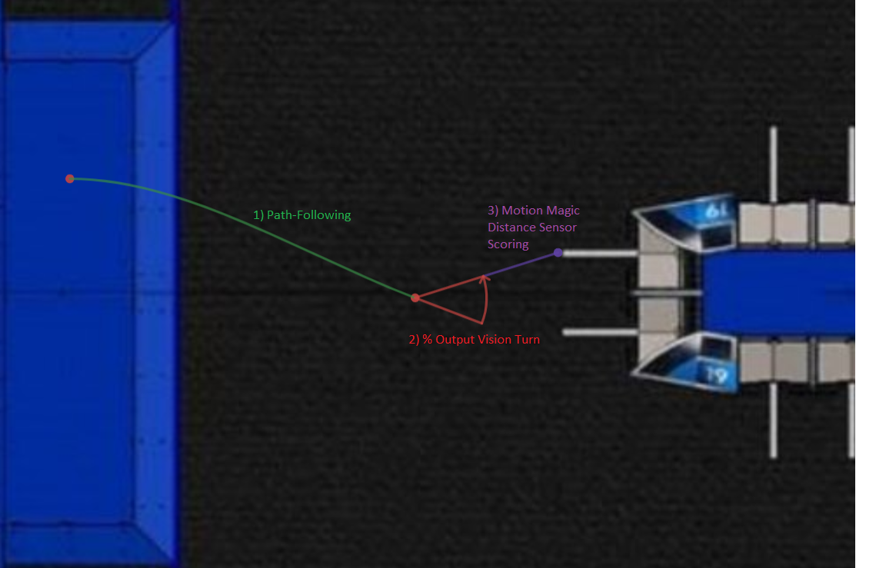

### The Beak Squad Autonomous Team Source Code 2019 ###

We run autonomous routines integrated using WPILib's Command structure. Therein, we follow preplanned paths of locally constant curvature arising as a consequence of locally constant velocity on a differential drive mobile robot, set our velocities using a TalonSRX velocity PID loop. We adaptively follow these paths based on sensor measurements from quadrature-based odometry sensing on our gearboxes and quaternionic Kalman filtering of accelerometer and gyro data on the NavX, whence we use the logarithmic map to the lie algebra of the group of isometries of two-dimensional Euclidean space (as a topology homeomorphic to the cartesian product of the plane and the circle, or in practice some compact path-connected subspace thereof) , to iteratively run a local fixed arc-length lookahead geometric path correction algorithm. We then use bang-bang control in a constrained PWM control space to adaptively point the chassis at the target angle based on limelight vision data. We then run a motion magic position PID loop simultaneously on both wheels using distance sensor data to drive to our scoring target. In total we combine these capabilities using our command structure to piece together full autonomous routines for advanced autonomous scoring capabilities. 

For more information see [here](https://www.youtube.com/watch?v=dQw4w9WgXcQ) .

**Visualisation Below For the auton Scoring algorithm**

As seen above, our scoring algorithm consists of 

 1) Following a pre-planned Path of arc with encoder and navx data 

  2)A Percent output turn in place based on limelight data. 

  3) A Motion Magic PID loop from distance sensor distance. 
